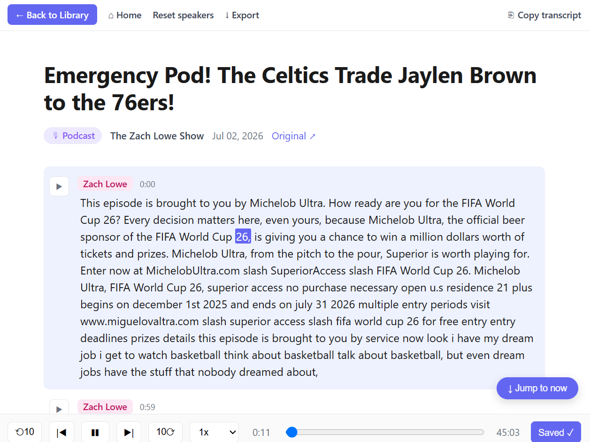

# Simple Transcriber for Podcasts & Videos

**[Scroll.ai](https://www.scroll.ai/) shuts down June 12, 2026.** Simple Transcriber is a free,
open-source desktop alternative — paste a YouTube link, a podcast URL, or upload a
local audio/video file and get back a speaker-labeled, audio-synced HTML transcript
you can read, edit, and quote from.



You get a transcript with:

- Per-paragraph play buttons synced to the audio
- Word-level highlighting that follows playback
- Editable speaker labels and title
- Inline text editing for fixing mis-transcribed names
- Paragraph bookmarks collected at the top as "Saved quotes"
- A browsable, full-text-searchable library of every transcript you've made
- Light and dark mode (follows your OS setting)

Uses [Groq's `whisper-large-v3`](https://console.groq.com) for transcription and
[AssemblyAI](https://www.assemblyai.com) for speaker diarization.

If you're looking for a more robust but still easy-to-install version and/or a Docker setup, try [Easy Transcriber](https://github.com/readtedium/easy-transcriber/) from [ReadTedium](https://github.com/readtedium).

---

## Install (Windows)

1. Download `SimpleTranscriber-Setup.exe` from the [Releases](../../releases) page.
2. Run it. The installer handles WebView2 (if not already on your system),
   creates a Start menu and desktop shortcut, and launches the app.
3. On first launch, paste your two API keys (see below). They're saved locally
   to `config.json` next to the app — nothing leaves your machine except the
   audio you submit for transcription.

That's it. After setup, paste a URL and click **Transcribe**, or click **Upload file**
to transcribe a local audio or video file.

## Getting API keys

Both are free, take under a minute, and have generous free tiers.

| Service | Sign up | Notes |
|---|---|---|
| **Groq** | https://console.groq.com → API Keys | Used for transcription. ~$0.11/hr of audio. |
| **AssemblyAI** | https://www.assemblyai.com → Dashboard | Used for speaker diarization. $50 free credit covers months of casual use. |

A typical 45-minute interview costs well under $0.50 total.

---

## Features

- **Per-paragraph playback** — click ▶ next to any paragraph to jump there
- **Word-level highlighting** — the active word lights up as audio plays
- **Auto-scroll with "Jump to now" pill** — follows playback; pauses scrolling
  when you scroll up to re-read, with a one-click way back to the live position
- **Editable speakers** — click a label to rename ("Speaker A" → "Jane Smith");
  choose to rename just one occurrence or all matching labels
- **Editable text and title** — click any paragraph or the title to fix typos
- **Split paragraphs** — shift+click any word to break a paragraph at that word,
  useful when the diarizer fuses two speakers into one block
- **Bookmarks** — star paragraphs worth quoting; they appear in a "Saved quotes"
  section at the top with jump links
- **Hints field** — paste proper nouns ("John Doe, ACME Co., NASA")
  before transcribing to help Whisper spell them correctly
- **URL queue** — paste multiple URLs (one per line) to process in sequence. Press Shift+Enter to start a new line.
- **Local file upload** — drop in any audio or video file (MP3, M4A, WAV, MP4, MOV,
  MKV, etc.) instead of a URL; ffmpeg extracts and transcodes audio automatically
- **Library page** — every transcript, searchable by title, date, or transcript content,
  sorted by when you transcribed it. Use Ctrl+F inside a transcript to jump through matches.
- **Light and dark mode** — follows your OS preference automatically
- **Copy and export** — copy a single quote (pre-formatted with attribution and
  timestamp), copy the full transcript, or export as `.txt` / `.md`

## Keyboard shortcuts (in a transcript)

| Key | Action |
|---|---|
| `Space` | Play / pause |
| `←` | Seek back 10 seconds |
| `→` | Seek forward 10 seconds |

Shortcuts are disabled while editing text so they don't interfere with typing.

---

## Where files live

- **Transcripts**: `Desktop\Transcripts\<title>\` — each gets its own folder
  with the HTML transcript, MP3 audio, and a small `.meta.json` sidecar
- **Library index**: `Desktop\Transcripts\index.html` — regenerated after
  every run
- **Config**: `config.json` next to the installed `.exe` — your API keys and
  window geometry

You can move the `Transcripts` folder if you want — the app reads/writes to
`%USERPROFILE%\Desktop\Transcripts`.

---

## Privacy

Audio you transcribe is uploaded to Groq (transcription) and AssemblyAI
(diarization). Both have published privacy policies; neither is used for
training by default. Everything else — your API keys, the transcripts
themselves, the library — stays on your machine.

## Limits

- **Groq free tier** caps uploads at 25MB. The app encodes audio as mono MP3
  at 32kbps (~14MB/hour), so typical interviews up to ~90 min fit comfortably.
  Longer files are auto-chunked and stitched back together.
- **Transcription quality** is high (Whisper large-v3, ~95–98% on clear audio).
  Speaker labels are good but not perfect — expect occasional misattributions
  at speaker transitions, especially with more than two speakers. Suitable as
  a readable working transcript, not a substitute for human review before
  publication.

---

## Install from source (instead of the installer)

If you'd rather run the Python directly:

```cmd
git clone https://github.com/jcddc83/simple-transcriber.git
cd simple-transcriber
pip install -r requirements.txt
python transcribe.py
```

Requires Python 3.11+ and FFmpeg on your PATH (or `ffmpeg.exe` next to the
script). On Windows, the easiest FFmpeg install is via
[gyan.dev](https://www.gyan.dev/ffmpeg/builds/) — download "release essentials",
unzip, and drop `ffmpeg.exe` next to `transcribe.py`.

## Building the installer

```cmd
build.bat
iscc installer.iss
```

`build.bat` downloads FFmpeg and the WebView2 bootstrapper automatically if
they aren't already present, then packages everything into
`dist\SimpleTranscriber.exe` via PyInstaller. `iscc installer.iss` (from
[Inno Setup](https://jrsoftware.org/isinfo.php)) wraps it into
`Output\SimpleTranscriber-Setup.exe`.

## macOS

A `build.sh` script exists for producing a Mac `.app` bundle, but it hasn't
been tested end-to-end yet. The Python code itself is cross-platform; pywebview
uses WKWebView on macOS (built in, no extra dependency).

---

## Troubleshooting

- **"Windows protected your PC" on first launch** — because the app isn't
  code-signed, Windows SmartScreen shows an "unrecognized app" warning the
  first time you run the installer. Click **More info → Run anyway**. This is
  expected for independent apps without a commercial code-signing certificate.
- **Antivirus false positive** — PyInstaller-packaged apps occasionally trigger
  Windows Defender or other AV scanners (the unpack-then-run pattern looks
  suspicious to heuristic scanners). If your AV quarantines the installer, add
  an exception for `SimpleTranscriber-Setup.exe`, or run from source instead.
- **"ffmpeg not found"** (running from source) — make sure `ffmpeg.exe` is
  in the `transcriber/` folder or on your system PATH.
- **YouTube rate-limited** — `yt-dlp` occasionally gets throttled by YouTube.
  Wait an hour and try again, or run with browser cookies (advanced).
- **Audio >25MB after encoding** — automatic chunking handles it, but very
  long files (3+ hours) may need manual splitting.
- **Window opens but stays blank** — make sure WebView2 Runtime is installed.
  The installer handles this; if you're running from source, download it from
  [Microsoft](https://developer.microsoft.com/microsoft-edge/webview2/).

---

## Credits

- Transcription: [Groq](https://groq.com) (whisper-large-v3)
- Diarization: [AssemblyAI](https://www.assemblyai.com)
- Audio download: [yt-dlp](https://github.com/yt-dlp/yt-dlp)
- Desktop window: [pywebview](https://pywebview.flowrl.com)
- App icon: Transcription icons created by Freepik —
  [Flaticon](https://www.flaticon.com/free-icons/transcription)

## License

Personal use, MIT-licensed. See `LICENSE` if present.
